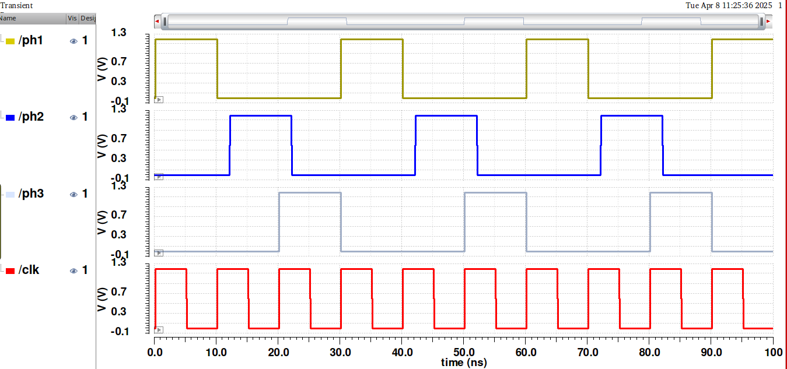

# Custom Plot Styling for Cadence Virtuoso (65nm PDK)

This repository customizes the default plotting appearance in Cadence Virtuoso for the 65nm PDK. It improves the visibility and consistency of plots by adjusting colors, fonts, and line styles.

## 📊 Example Plots



## 🛠️ Setup Instructions

### 1. Modify `.cdsinit`

1. Navigate to your PDK folder.
2. Show hidden files (e.g., by pressing `Ctrl + H`).
3. Open the `.cdsinit` file.
4. Append the following content at the end of the file:

```lisp
;//#############################################################################################
;//#
;//# VIVA Plot Customization
;//#
;//#############################################################################################

envSetVal("viva.rectGraph" "background" 'string "white")

; Axis font and size
envSetVal("viva.axis" "font" 'string "Helvetica,14,-1,5,75,0,0,0,0,0")

; Marker font and digits
envSetVal("viva.pointMarker" "font" 'string "Helvetica [Misc],14,-1,5,75,0,0,0,0,0")
envSetVal("viva.pointMarker" "sigDigitsMode" 'string "Manual")
envSetVal("viva.pointMarker" "significantDigits" 'string "3")

; Vertical marker settings
envSetVal("viva.vertMarker" "font" 'string "Helvetica [Misc],14,-1,5,75,0,0,0,0,0")
envSetVal("viva.vertMarker" "sigDigitsMode" 'string "Manual")
envSetVal("viva.vertMarker" "significantDigits" 'string "3")

; Horizontal marker settings
envSetVal("viva.horizMarker" "font" 'string "Helvetica [Misc],14,-1,5,75,0,0,0,0,0")
envSetVal("viva.horizMarker" "sigDigitsMode" 'string "Manual")
envSetVal("viva.horizMarker" "significantDigits" 'string "3")

; Trace style
envSetVal("viva.trace" "lineThickness" 'string "ExtraThick")
envSetVal("viva.trace" "lineStyle" 'string "solid")

; Legend font
envSetVal("viva.traceLegend" "font" 'string "Helvetica,16,-1,5,75,0,0,0,0,0")

; Δx/Δy marker settings
envSetVal("viva.multiDeltaMarker" "font" 'string "Helvetica [Misc],14,-1,5,75,0,0,0,0,0")
```

> 💡 This only applies to plots generated from expressions. Plots generated directly from schematics will still use the default PDK settings.

### 2. Update Layer Colors

To adjust schematic-based plots (especially those dependent on layer colors):

1. Copy the provided `display.drf` file from this repository.
2. Replace the `display.drf` in your PDK folder with this one.

> ⚠️ Note: This customization is only tested and validated for the 65nm PDK. It may not work correctly with other PDKs.
